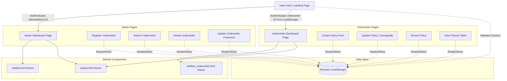
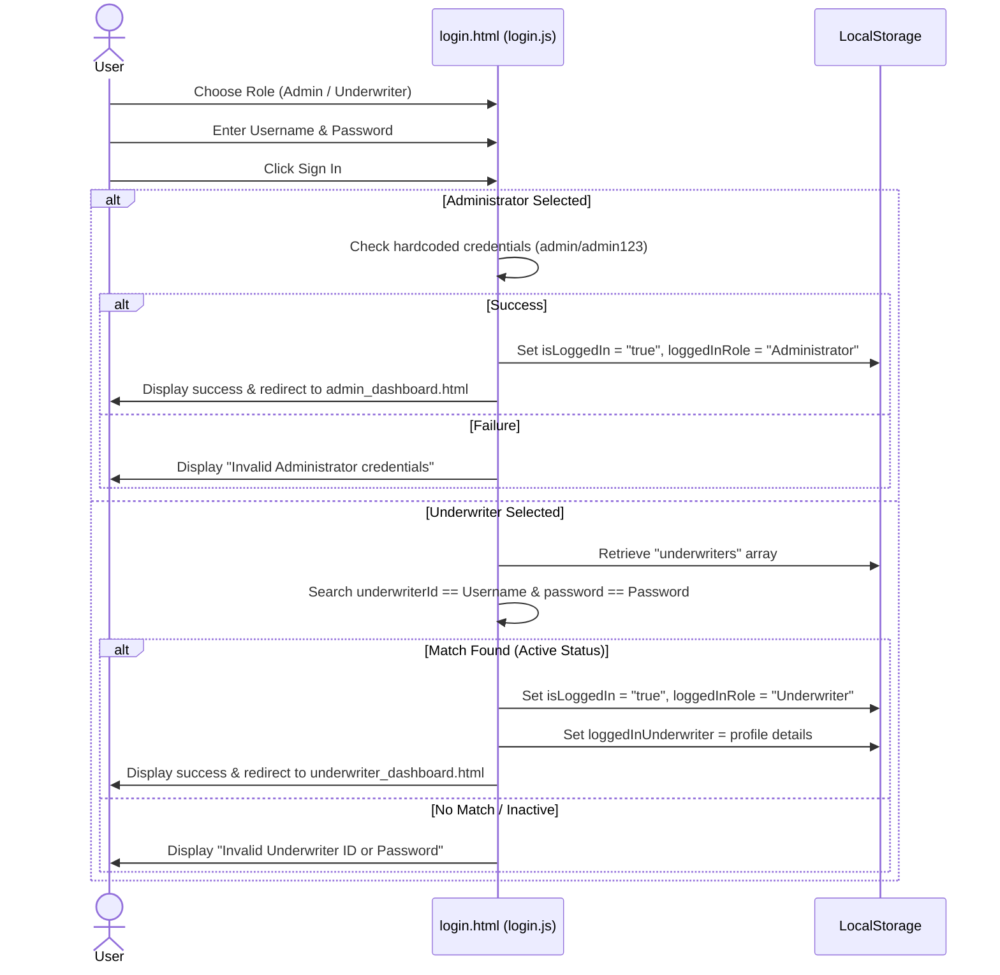

# 🚗 Vehicle Insurance Management System (VIMS)
## Architecture, Workflow, Dataflow & Viva Prep Guide

This document provides a comprehensive breakdown of the VIMS project structure, architecture, workflows, data models, and business logic, along with key areas for assessment/questions.

---

## 1. Overall Project Explanation

**Drive Secure - Vehicle Insurance Management System** is a lightweight, client-side web application designed for insurance firms to manage vehicle policies.
- **Serverless/Client-Side Execution**: VIMS has **no server-side backend or active database server**. The entire presentation layer, business logic, and storage management execute directly within the user's browser.
- **Persistent State via LocalStorage**: The application persists its application state across sessions using the browser's synchronous key-value storage engine, **LocalStorage**. All data structures are marshaled to JSON strings for storage and unmarshaled back to runtime JavaScript arrays/objects upon page execution.
- **Role-Based Access Control (RBAC)**: The app exposes two workflows based on the logged-in user's role:
  - **Administrator**: Responsible for Managing Underwriters (CRUD: Create, Read, Update, Delete accounts).
  - **Underwriter**: Responsible for Managing Customer Policies (Create policies, View policies, Update policy types, and Renew policies).

---

## 2. Project Architecture

The system uses a **Single-Frame/Iframe Hybrid Architecture** to achieve component reuse without dynamic framework routing (like React Router or Vue Router).

### 2.1 Architectural Diagram



### 2.2 Directory Hierarchy and Modules
- **`/components/`**: Reusable modules inserted into pages. Navbar and Sidebars are built as stand-alone HTML files and loaded using `<iframe>` elements to keep layout files clean and DRY.
- **`/admin/`**: High-privilege management views. Modifies the `"underwriters"` key in LocalStorage.
- **`/underwriter/`**: Core business views. Interacts with the `"policies"` key in LocalStorage.

---

## 3. Workflow Specification

### 3.1 Authentication Workflow



### 3.2 Underwriter Lifecycle Workflow
1. **Creation**: Underwriter registers a new policy via the `create_vehicle_insurance` form. The system auto-calculates premium amounts and end dates based on inputs.
2. **Read/Monitor**: Underwriter inspects their registered policies under `view_policy` (which automatically checks each policy's validity by comparing the expiration date against the current browser date).
3. **Downgrading (Update)**: Underwriter changes the insurance type from `Full Insurance` to `Third Party`.
4. **Renewal**: Policy dates are extended by 365 days from the date of renewal.

---

## 4. Dataflow Specification

Since VIMS uses no backend APIs, the dataflow is strictly circular between the **DOM (HTML Forms/Tables)** and the **Browser LocalStorage API**.

### 4.1 Dataflow Pattern (Write Operation)

```
[User inputs values in Form]
             │
             ▼
[JS validation triggers via Event Listener ('submit' / 'change')]
             │
             ▼
[JS reads inputs & parses existing LocalStorage array: JSON.parse(localStorage.getItem('key'))]
             │
             ▼
[New object is created and pushed onto array]
             │
             ▼
[Array stringified: localStorage.setItem('key', JSON.stringify(array))]
             │
             ▼
[Redirect user or update DOM dynamically]
```

### 4.2 Data Model Definitions

#### Underwriter Object Schema
Stored in `localStorage["underwriters"]`:
```typescript
interface Underwriter {
  underwriterId: string;   // Unique Key (Format: UW + 4 Digits)
  name: string;            // Alphabetic string
  dob: string;             // ISO Date string (YYYY-MM-DD)
  joiningDate: string;     // Calendar date string
  registeredOn: string;    // Registration timestamp
  password: string;        // Plaintext credentials
  status: "Active" | "Inactive"; 
}
```

#### Policy Object Schema
Stored in `localStorage["policies"]`:
```typescript
interface Policy {
  policyNo: string;        // Unique Key (10-20 Alphanumeric characters)
  vehicleNo: string;       // Registration format: e.g. KL07AB1234
  vehicleType: "2 Wheeler" | "4 Wheeler";
  customerName: string;    // Alphabetical string
  engineNo: string;        // Alphanumeric, 8-17 characters
  chassisNo: string;       // 17 characters VIN format (Excludes I, O, Q)
  phoneNo: string;         // 10 digits starting with 6-9
  insuranceType: "Full Insurance" | "Third Party";
  premium: string;         // String representing cost (e.g. "10000" or "2500")
  fromDate: string;        // Start Date (DD-MM-YYYY format)
  toDate: string;          // End Date (DD-MM-YYYY format)
  underwriterId: string;   // Reference linking back to creator
  createdOn: string;       // ISO timestamp
  isUpdated?: boolean;     // Status tracking flag
  updatedAt?: string;      // Last modified date/time
  lastRenewedOn?: string;  // Last renewal date/time
}
```

---

## 5. Key Business Rules & Validation Constraints

VIMS maintains data integrity entirely via frontend JavaScript constraints:

| Domain | Rule | Code Implementation Detail |
|---|---|---|
| **Underwriter Identity** | Identifier uniqueness | Rejects registration if a lookup in the stored `underwriters` list returns a match for the input `underwriterId`. |
| **Underwriter ID Format** | Prefix and length check | Validated with Regex: `/^UW\d{4}$/` (Forces prefix "UW" followed by exactly 4 digits). |
| **Chassis No Validation** | Length & characters | Regex: `/^[A-HJ-NPR-Z0-9]{17}$/` (Excludes letters `I`, `O`, and `Q` to prevent confusion with `1` and `0`). |
| **Vehicle No Format** | Indian Registration Standard | Regex: `/^[A-Z]{2}\d{2}[A-Z]{1,2}\d{4}$/` (e.g., `KL07AB1234`). |
| **Phone Number Format** | Mobile verification | Regex: `/^[6-9]\d{9}$/` (Ensures exactly 10 digits starting with a valid mobile prefix). |
| **From/To Policy Dates** | Expiry window | `From Date` must set `min` value to today's date. `To Date` auto-adds 365 days to the `From Date` value. |
| **Premium Cost Allocation** | Static cost grid | Two-dimensional lookup matching `vehicleType` and `insuranceType`: <br>• 2W + 3rd Party = **Rs. 2,500** <br>• 2W + Full = **Rs. 4,500** <br>• 4W + 3rd Party = **Rs. 6,000** <br>• 4W + Full = **Rs. 10,000** |
| **Downgrade Restricton** | Policy update limit | Users can transition a policy type from `Full Insurance` to `Third Party` (premium drops to standard 3rd party rate), but cannot upgrade a policy from `Third Party` to `Full`. |

---

## 6. Viva & Interview Questions Bank

Below is a collection of high-frequency questions that can be asked about this project during code reviews, vivas, or technical interviews.

### Category A: Architecture & Client-Side Design

#### 1. Why did you choose LocalStorage over IndexedDB, and what are its main limitations?
* **Answer**: LocalStorage was chosen for its simplicity and direct, synchronous key-value API (`getItem`/`setItem`), which is suitable for a prototype. Its main limitations are:
  - **Storage Limit**: Capped at ~5MB depending on the browser.
  - **Synchronous Execution**: Operations block the main UI thread (a concern if the dataset grows large).
  - **Security**: Data is stored as plaintext JSON in the browser, making it vulnerable to Cross-Site Scripting (XSS) extraction.
  - **Type constraints**: It can only store strings, requiring constant parsing and stringifying of JSON.

#### 2. How do pages inside the admin and underwriter directories reuse the sidebar/navbar components without server-side templating?
* **Answer**: Reusable UI components are structured as standalone HTML files inside `/components/`. Parent pages load these files dynamically using `<iframe>` tags positioned using absolute layout properties in CSS. 
  *Example*: `<iframe src="../../components/navbar/navbar.html" class="navbar-frame"></iframe>`

#### 3. How does the application verify that a user is logged in, and how are unauthorized users prevented from accessing dashboard pages?
* **Answer**: Pages check session validation flags on page load (e.g., in a shared script or dashboard code) by looking up the keys `isLoggedIn` and `loggedInRole` in LocalStorage. If the user tries to load a page without these variables set, the system triggers a redirection: `window.location.href = "../../index.html"`.

---

### Category B: JavaScript Programming & Data Management

#### 4. When creating a policy, how is the dynamic `To Date` computed in JS, and how do you ensure the user cannot manually edit it?
* **Answer**: An event listener is attached to the change event of the `From Date` input. When fired, it parses the input value into a JavaScript `Date` object, adds 365 days via `date.setDate(date.getDate() + 365)`, formats the output to `DD-MM-YYYY`, and binds it to the value of the `To Date` input. To block manual edits, the HTML input is explicitly configured with the `readonly` attribute: `<input type="text" id="toDate" readonly>`.

#### 5. How does the system restrict underwriters to seeing only the policies they created?
* **Answer**: Upon login, the underwriter's ID is saved in LocalStorage under the `loggedInUser` object. In `view_policy.js` and `underwriter_dashboard.js`, all policies are fetched from LocalStorage, and a filter function runs to extract matching policies before rendering:
  ```javascript
  const filtered = allPolicies.filter(p => p.underwriterId === loggedInUser.id);
  ```

#### 6. Why is `JSON.parse()` and `JSON.stringify()` used heavily throughout the codebase?
* **Answer**: LocalStorage is a key-value store that exclusively accepts strings. To write a rich object or array structures, we must convert it to a string representation using `JSON.stringify()`. To retrieve and work with the collection dynamically as array elements or properties in JS, we must parse the string back into memory using `JSON.parse()`.

---

### Category C: Business Logic & Edge Cases

#### 7. How does the application enforce the "Downgrade Only" policy change rule?
* **Answer**: In `update_policy.js`, when a policy is retrieved by entering its ID, the script reads its current `insuranceType`. If the current value matches `"3rd Party Insurance"`, the dropdown/form controls for updating the insurance type are locked, and the update action button is disabled via `document.getElementById("updateBtn").disabled = true;`.

#### 8. What happens to the policy premium when a user downgrades a policy?
* **Answer**: The system automatically overrides the premium field. According to the business logic, when a policy is downgraded to "Third Party", the premium is reset to the base rate of that vehicle category (Rs. 2,500 for 2 Wheelers, Rs. 6,000 for 4 Wheelers).

#### 9. Why are letters "I", "O", and "Q" prohibited in the Chassis Number validation?
* **Answer**: This matches the international standard for **Vehicle Identification Numbers (VIN)**. These letters are excluded globally to prevent reading errors with numeric digits: `I` could be mistaken for `1`, `O` for `0`, and `Q` for `9` or `0`. The regex pattern enforces this: `/^[A-HJ-NPR-Z0-9]{17}$/`.

#### 10. How does the dashboard pie chart distribute policy types?
* **Answer**: The dashboard script loops through the filtered policy array for the logged-in underwriter, tallies instances where `insuranceType === "Full Insurance"` vs `"Third Party"`, maps these values to angles/percentages, and uses CSS variables or a canvas/charting rendering function to render the graphical distribution.
